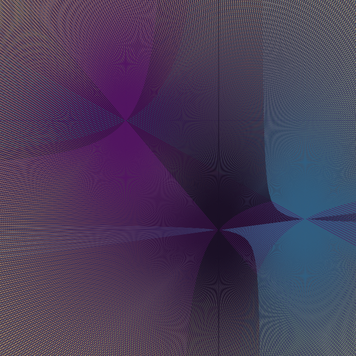

# curvergence

> It's interesting how curves can emerge from straight lines.

## usage

- tap/click on the canvas to add and remove origin points
- press play to start the animation
- once completed press reload to begin again
- a new palette can be generated by refreshing the page

## installation

Curvergence is written in vanilla javascript. It can either be run directly at madacoo.github.io/curvergence or the repository can be cloned and index.html opened in a browser.

## examples

-

-

## license

[GPL v3](LICENSE)

