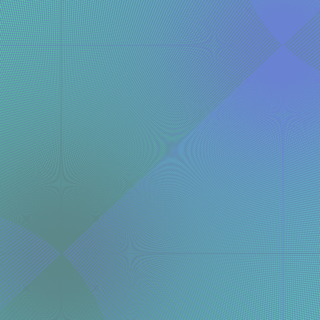
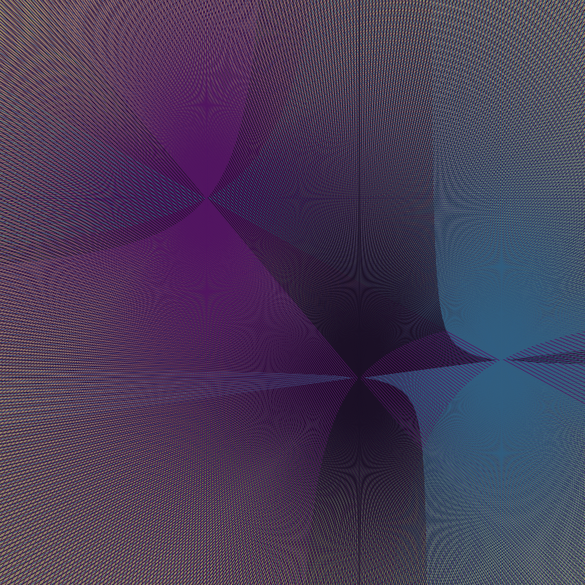

# Curvergence

> It's interesting how curves can emerge from straight lines.

## Usage

- tap/click on the canvas to add and remove origin points
- press play to start the animation
- once completed press reload to begin again
- a new palette can be generated by refreshing the page

Note: It is also possible to pass 'width' and 'height' parameters via a GET request in order to specify the size of the canvas. Useful for making backgrounds for desktop or mobile.

## Installation

Curvergence is written in vanilla javascript. It can either be run directly [here](madacoo.github.io/curvergence) or the repository can be cloned/downloaded and index.html opened in a browser.

## Examples

---

---

## License

[GPL v3](LICENSE)

